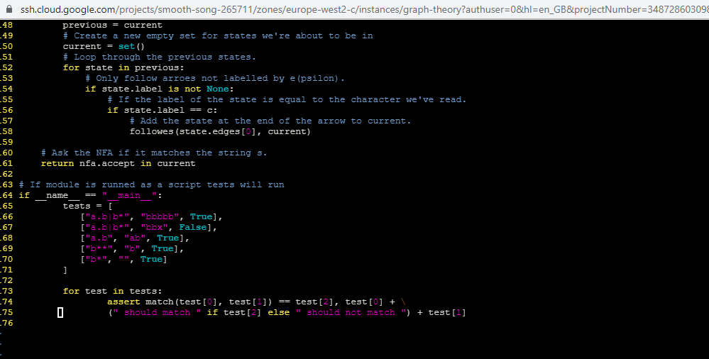
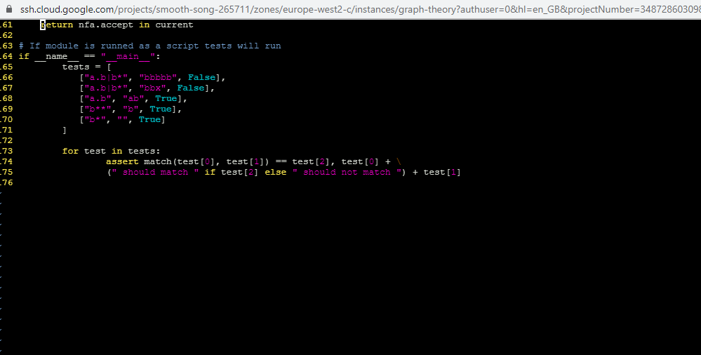

# To run this program
To run this program you will need to install python on your machine. 
Click [here] (https://www.codecademy.com/articles/install-python) to learn more about python and how to install it on your machine. 

# To test this program 
1. Type the following on a command line of a machine that has python installed:
```bash
    python RegularExpressionEngine.py
```
* If no errors are displayed on the console the tests have runned correctly



* If the console displays errors, the tests have failed to run correctly.



2. Import the RegularExpressionEngine.py script into your python program then use the method match from the script and pass it a regex followed by a string to match.

Example: 
```python
    match('a.b|b*','bbbbbb')
```

# Overview

Write a program in the Python programming language, that can build a non-deterministic finite automaton (NFA)
from a regular expression and can use the NFA to check if the regular expression matches any given string of text.

## Introduction

In world where the amounts of data produced each day is increasing at an extreme rate, it could be really tought to search through
those huge amounts of data, especially in an efficient way. 
A great solution for this type of problem was the invention of regular expressions which makes finding specific words, frases or patterns of text a lot easier.

#### Regular expressions

A regular expression also refered to as regex is basically a pattern describing a certain amount of text, it is the key to powerful, flexible and efficient text processing. 
An example of a simple regular expression (or regex) is the word dog which will match the string 'dog'.
To further understand more complicated regular expressions, we need to be familiar with regex special characters. These are reserved characters in regex that hold a special meaning and the best way to understand them in my opinion is by examples.
For instances the character '*' is a quantifier in regex which tells the engine to attempt and match the procesing token once or more times. 
E.g. (regex 'a*' would match an empty string, the string 'a', the string 'aa' and so on...)
The character '.' is an operator that matches any character.
E.g (regex 'a.b' will match any string that follows the patern 'a"any characters"b', it would match a string like 'adb' but not match a string like 'ab' or 'afjb')

Learn more about regular expressions [here] (https://www.regular-expressions.info/)
See all special characters [here]! (https://medium.com/factory-mind/regex-tutorial-a-simple-cheatsheet-by-examples-649dc1c3f285)

Reference [Mastering Regular Expressions] 
(https://books.google.ie/books?hl=en&lr=&id=P5UXAwAAQBAJ&oi=fnd&pg=PR7&dq=regular+expressions&ots=HBnVe1kmTx&sig=Kf_2Qew1MARswyfbMOlZjqCt7L4&redir_esc=y#v=onepage&q=regular%20expressions&f=false)

#### NFA

A Finite Automata is the simplest machine to recognize patterns, it can be characterized into two types:
Deterministic Finite Automata (DFA)
Non-deterministic Finite Automata(NFA)
For this project I am required to use small NFA's to create an overall NFA that will process the regex. NFA are better suited for this problem as even though they are similar to DFA's they will allow us to solve the problem without using as many states as we would use in DFA's and we will also be able to follow epsilon (or null) arrows.

Learn more [here] (https://www.geeksforgeeks.org/introduction-of-finite-automata/)

## Shunting Yard Algorithm

When it comes to expressions humans are used to having special characters (or operaters) between the numbers in the expression, for example we write the equation 2+4, which implies that we take the two and add 4 to it. This kind of notation is known as infix notation, it is very intuitive for humans to follow but for machines, not so much. Machines prefer a different kind of notation which allows them to read and process the equations while reading them. For this the postfix notation is used. Postfix indicates that the special characters (or operators) should be placed at the end of the expression rather than between.
Having this in mind the first step for this project was to convert the infix regex into postfix regex, for this I used a famous algorithm called the shunting yard algorithm.

Learn More [here] (https://en.wikipedia.org/wiki/Shunting-yard_algorithm)

The implementation of the algorithm was as follows:

Expressions are parsed left to right.
Each time a number or operand is read, we push it to the stack.
Each time an operator comes up, we pop the required operands from the stack, perform the operations, and push the result back to the stack.
We are finished when there are no tokens (numbers, operators, or any other mathematical symbol) to read. The final number on the stack is the result.

Refer to [Brilliant.org] (https://brilliant.org/wiki/shunting-yard-algorithm/)

First, I defined a method that would take in an infix regex and return a postfix regex

Inside the method the first step was to convert the infix into a stack kind of list that would allow me to add characters into the list and pop them off the top of the list. For that I created a list and reversed it so that the first characters would be at the end.

```python
    infix = list(infix)[::-1]
```

Next, I defined one empty stack list to hold the operators of the expression and another list for the postfix regex. I also needed a way to establish the precedence of the operators, for that I created a dictionary that would show the precedence of the operators through values defined by me. E.g the higher the number the highest the precedence.

```python
    opers, postfix = [], []

    prec = {'*' : 100, '.': 80, '|' : 60, '(' : 40, ')' : 20}
```

After establishing the lists and the dictionary required, I started to work on the algorithm. The first step of the actual algorithm is to pop characters from the infix expression while the infix stack is not empty. For most characters the only thing that the algorithm will do is pop them from the infix and append them to the postfix list, the exception for that would be if the character (in this case represented by 'c') is an operator or a bracket. 

```python
   while infix:
        # Pop a character from the input.
        c = infix.pop()

        # Decide what to do based on the character.
        if c == '(':
            # Push an open bracket to the opers stack
            opers.append(c)
        elif c == ')':
            # Pop the operators stack until you find an (.
            while opers[-1] != '(':
                postfix.append(opers.pop())
            # Get rid of the '('.
            opers.pop()
        elif c in prec:
            # Push any operators on the opers stack with higher prec to the output.
            while opers and prec[c] < prec[opers[-1]]:
                postfix.append(opers.pop())
            # Push c to the operator stack.
            opers.append(c)
        else:
            # Typically, we just push the character to the output.
            postfix.append(c) 
```

When the character I'm reading is equal to '(' I need to append it to the operator’s stack
```python
    if c == '(':
        # Push an open bracket to the opers stack
        opers.append(c)
```
If it is equal to ')' then I need to pop everything off of the opers stack until I find an open bracket, and then discard the open bracket
```python
    elif c == ')':
        # Pop the operators stack until you find an (.
        while opers[-1] != '(':
            postfix.append(opers.pop())
        # Get rid of the '('.
        opers.pop()
```
If the character is not an open or a closed bracket and it's in the dictionary created before, I need to check the operator stack to see if there are any operator with higher precedence than the one that I am currently reading, if there is, I first need to push those higher precedence operators into the postfix list and only then append the operator that I am currently reading into the operators stack while also keeping in mind that if I ask python for the last element of an empty list I will get an error.
```python
    elif c in prec:
        # Push any operators on the opers stack with higher prec to the output.
        while opers and prec[c] < prec[opers[-1]]:
            postfix.append(opers.pop())
        # Push c to the operator stack.
        opers.append(c)
```
And lastly if the character that I am reading is just a normal character I just need to append it to the postfix list.
```python
    else:
        # Typically, we just push the character to the output.
        postfix.append(c) 
```

Once I am finished with the infix list and there are no more elements left in it, I will pop any operators left in the operators stack and will append them to postfix list.

And lastly if the character that I am reading is just a normal character I just need to append it to the postfix list.
```python
    # Pop all operators to the output.
    while opers:
        postfix.append(opers.pop())
```

By this stage I completed the shunting yard algorithm and I have a list containing the infix regex in postfix notation. But before returning the postfix regex I want to convert it to a string rather than have it as a list. For that I use python's string method '.join()' that will convert every element on a list to a string and join it together with whatever string we specify in between, in my case I want to join it with an empty string in between to build a postfix regex string.
```python
    # Convert output list to string.
    return ''.join(postfix)
```

## NFA 
Next the project required us to use NFA's to solve the problem, so I needed to find ways of representing the NFA's in python
NFA's like DFA's consume a string of input symbols, for each input symbol it transitions to a new state untill all input symbols have been consumed, if at the end of that process any of those transitions land in an accept state, the input is accepted otherwise it's rejected.
In NFA's we do not require to have an arrow from every state to each symbol unlike DFA's, this will make solving the problem easier as I'll end up using less states.
With NFA's I can have any number of arrows goin from each state to each symbol, this allows for parallel processing of the automatons which in this problem will be really useful to break the regex into smaller regex using NFA's that are part of a bigger NFA so I will be able to process the regex as it's being read by the machine.

First, I need a class to represent states in an NFA, each state can have one or two arrows but can also have an episilon arrow, which I will represent by a zero arrow. So, I defined a class with a contructor that would take in the label for the arrows which if empty means an epsilon arrow, and an array of edges that will represent the number of arrows in the state.
```python
class State:
    """A state with one or two edges, all edfes labeled by label. """

    # Constructor for the class.
    def __init__(self, label=None, edges=[]):
        # Every state has 0,1, or 2 edges from it.
        self.edges = edges if edges else []
        # Label for the arrows. None means epsilon.
        self.label = label
```

After having a way to represent states I also needed a way to represent NFA fragments that would contain a start state and an accept state. For this I created another class with a contructor that would take in two states, one labeled start and another one label accept.
```python
class Fragment:
    """An NFA fragment with a start state and an accept state. """
    # Contructor
    def __init__(self, start, accept):
        self.start = start
        self.accept = accept 
```
With the 2 classes created for my states and NFA fragments I could now create objects from them using their contructors, so I proceded to create a method that would compile the infix regex into an NFA fragment and return it because after reserching through packages that deal with regex, there's ussually a method to compile the regex into an NFA because if a user wants to match the same regex to different strings he will not need to recreate the entire NFA and can use the already compiled NFA to match against other strings.

To achieve that I first need to convert the infix regex to postfix using my shunting yard method previously created and store it in a variable, then I convert the postfix string into a stack of characters by turning it into a list and reversing the list. The last thing I needed to do was establishing a way of storing the smaller NFA's, for that I created an empty nfa stack list.
```python
   """Return an NFA Fragment representing the infix regular expression."""
    # Convert to infix
    postfix = shunt(infix)
    # Make postfix a stack of characters
    postfix = list(postfix)[::-1]
    # A stack for NFA fragments.
    nfa_stack = [] 
```
After that I can proceed to process the postfix regex, first I started a loop that will run until the postfix regex is empty. Inside the loop I want to create small NFA's (or NFA fragments) while I read the regex and add them to the nfa stack.
Each time I pop a character from the postfix regex I will set it's accept and start state, and then create a new fragment using the start and accept states in the contructors of my fragment class, and at the end append the new fragments into the nfa stack.

For each character poped from the postfix I will process the nfa states in different ways. 

* If I pop a normal character, I will set accept to an empty state and start to a state labeled by the character and having the accept state as it's edge.
```python
    accept = State()
    start = State(label=c,edges=[accept])
```
* If I pop the character '.' I need to pop two fragments of the nfa stack and point the second fragment accept state to the first fragment start state. Finally, the start state of the new frament that we will be creating will be the second fragment start state and the accept state will be the first fragment accept state.
```python
    # Pop two fragments off the stack
    frag1 = nfa_stack.pop()
    frag2 = nfa_stack.pop()
    # Point frag2 accept state at frag1 start state
    frag2.accept.edges.append(frag1.start)
    # The new start state is frag2's
    start = frag2.start
    # The new accept state is frag1's
    accept = frag1.accept
```

* If I pop the character '|' I need to once again pop two fragments of the nfa stack and then a new accept state and a start state that points to the edges of the second fragment start state and the first fragment start state. Finally, I need to point the old fragments accept states to the new accept state.
```python
    # Pop two fragments off the stack
    frag1 = nfa_stack.pop()
    frag2 = nfa_stack.pop()
    # Create new start and accept states.
    accept = State()
    start = State(edges=[frag2.start, frag1.start])
    # Point the old accept states at the new one
    frag2.accept.edges.append(accept)
    frag1.accept.edges.append(accept)
```

* If I pop the '*' character I need to pop one fragment of the stack, create a new accept state and a start state that points to the poped fragment start state and the new accept state that I created. Finally extend the poped fragment edges by pointing them to the poped fragment start state and the new accept state that I created.
```python
    # Pop one fragment off the stack.
    frag = nfa_stack.pop()
    # Create new start and accept states.
    accept = State()
    start = State(edges=[frag.start, accept])
    # Point the arrows.
    frag.accept.edges.extend([frag.start, accept])
```

When the postfix regex is empty I should now have an nfa stack with exactly one NFA on it which I will return to the method at this point.
```python
    # The NFA stack should have extactly one NFA on it.
    return nfa_stack.pop()
```

The next step was to create the main method that would match the regex to the string using the automaton that I build, for this I defined a method that takes in a regex and the string that the regex should match, this method returns weather or not the regex matches the string.

The first thing I did was compile the regex into an NFA, for that I used the method that I created earlier
```python
     nfa = compile(regex)
```

Then I needed a way of keeping track of the states that we are currently in, but I also needed a way of following the epsilon arrows in the states. So first I defined an empty set to keep track of the states that we are currently in and I created a new method to follow the epsilon arrows.
```python
    current = set()
```

In this method I first need to check if the state itself is in current, if it's not then I had the state to current. Then I need to check if the state is labeled by epsilon, which in my case means that the label is equal to none. If it is, I then need to loop through all of the states pointed to by this state and and make sure that follows all of it's epsilon arrows to by recursively calling the follow es method.
```python
    # Only do something when we haven't already seen the state. 
    if state not in current:
        # Put the state itself into current.
        current.add(state)
        # See whether state is labelled by e(psilon)
        if state.label is None:
            # Loop through the states pointed to by this state.
            for x in state.edges:
                # Follow all of their e(psillon)s too.)
                followes(x, current)
```
I then call my new method inside the match method and pass it the start start state of my NFA together with the current state.
```python
    followes(nfa.start, current)
```

I also need a set to keep track of the previous states.
```python
    previous = set()
```

I then can finally start matching the characters in my string to the expression. To do this I loop through every character in the string and use the previous set to keep track of where I am, while also creating a new current set for the states that we are about to be in.
```python
    for c in s:
        # Keep track of where we were.
        previous = current
        # Create a new empty set for states we're about to be in
        current = set()
```
I will then loop through the previous states and I will follow the arrows that are not labeled by epsilon, and if the label of the state is equal to the character that I am currently reading add the state at the end of the arrow to the current state.
```python
 for state in previous:
            # Only follow arroes not labelled by e(psilon).
            if state.label is not None:
                # If the label of the state is equal to the character we've read.
                if state.label == c:
                    # Add the state at the end of the arrow to current.
                    followes(state.edges[0], current)
```
Finally, to conclude the method I'll ask the NFA if it matches the string by checking if the nfa accept state is in the current state set and return the answer.
